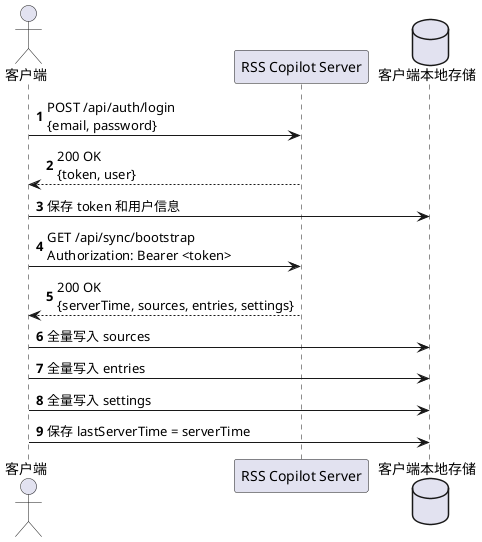
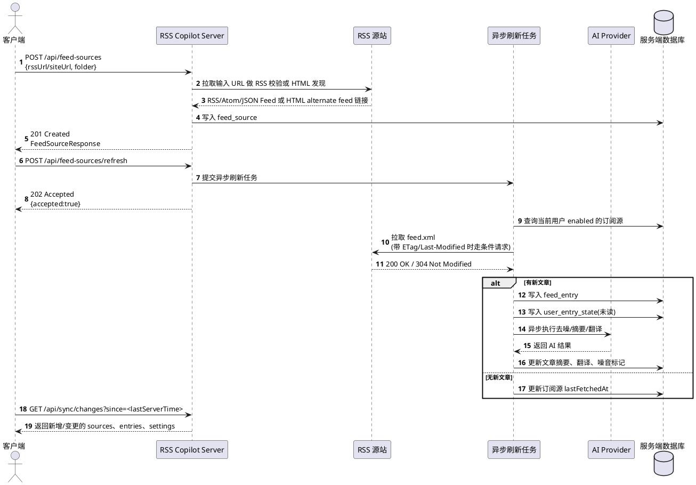
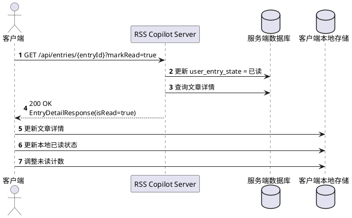
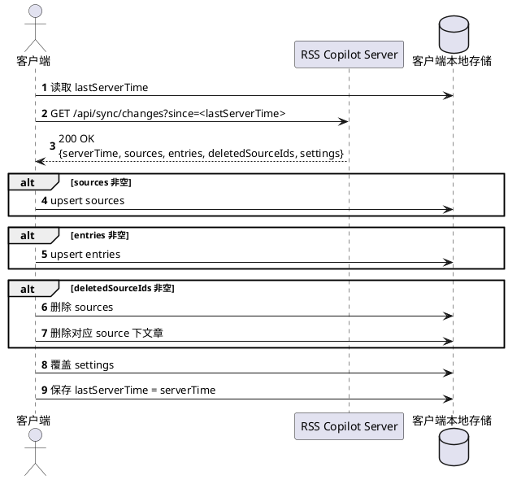
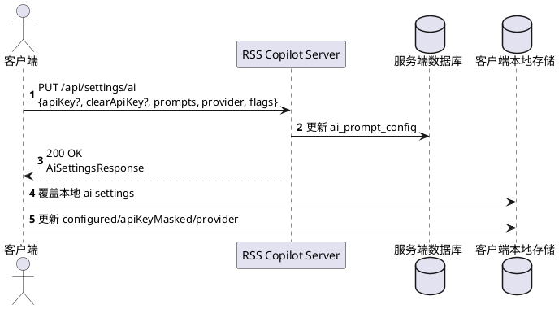

# RSS Copilot Server 接口文档

本文档面向客户端开发人员，描述当前服务端已经实现的接口、协议约定、请求头、请求参数、响应结构以及接入注意事项。客户端应以本文档和现有接口行为为准进行开发。

## 1. 服务概览

- 基础地址：`http://<host>:<port>`
- 默认端口：`8080`
- 接口前缀：`/api`
- 协议：`HTTP/1.1`
- 数据格式：`application/json`
- 字符编码：`UTF-8`

当前接口分为 6 组：

1. 系统：健康检查
2. 认证：登录、获取当前用户、退出登录
3. 订阅源：订阅源增删改查、文件夹分组、OPML 导入导出、全量/单源手动刷新、按订阅查看文章
4. 文章：Feed/Noise/Saved/All 列表、详情、已读与收藏状态管理
5. 设置：AI 配置、外观、语言、账号信息
6. 同步：全量快照、增量同步

## 2. 通用协议约定

### 2.1 请求头

除 `GET /api/health` 和 `POST /api/auth/login` 外，所有 `/api/**` 接口都必须带 Bearer Token：

```http
Authorization: Bearer <token>
```

发送 JSON 请求体时请携带：

```http
Content-Type: application/json
Accept: application/json
```

### 2.2 认证方式

- 登录成功后，服务端返回 `token`
- 客户端自行持久化 `token`
- 之后所有受保护接口都通过 `Authorization: Bearer <token>` 调用
- 服务端为无状态 Bearer Session
- Session 默认有效期为 30 天
- 每次成功访问受保护接口，服务端都会刷新 Session 过期时间

### 2.3 时间格式

所有时间字段都使用 ISO 8601 UTC 字符串，例如：

```text
2026-04-08T10:00:00Z
```

同步接口中的 `since` 参数也必须传这个格式。

### 2.4 成功响应

- `200 OK`：普通查询/更新成功
- `201 Created`：创建成功
- `202 Accepted`：异步任务已接收
- `204 No Content`：成功但无响应体

### 2.5 失败响应

统一错误结构：

```json
{
  "code": "UNAUTHORIZED",
  "message": "invalid session",
  "timestamp": "2026-04-10T09:12:33.123Z"
}
```

常见错误码：

| HTTP 状态 | code | 说明 |
| --- | --- | --- |
| 400 | `BAD_REQUEST` | 参数错误、URL 非法、RSS 无法访问、请求体验证失败 |
| 401 | `UNAUTHORIZED` | 未登录、Token 缺失、Token 无效、Session 过期 |
| 404 | `NOT_FOUND` | 资源不存在 |
| 409 | `CONFLICT` | 资源冲突，例如重复添加同一个 RSS 源 |
| 413 | `PAYLOAD_TOO_LARGE` | 请求内容过大，例如 OPML 文件超过导入上限 |
| 500 | `INTERNAL_SERVER_ERROR` | 服务器内部异常 |

说明：

- 参数校验失败时，`message` 会优先返回具体字段或全局校验错误
- 查询参数或路径变量类型不匹配时，会返回 `400 BAD_REQUEST`，`message` 格式为 `invalid request parameter: {name}`
- JSON 请求体格式错误、类型不匹配或无法解析时，会返回 `400 BAD_REQUEST`，`message` 为 `request body is invalid`
- 未预期异常会返回 `INTERNAL_SERVER_ERROR`；响应不会暴露内部细节，服务端会记录请求路径和异常栈用于排查

## 3. 数据结构

### 3.1 AuthUserResponse

```json
{
  "id": 1,
  "email": "demo@rsscopilot.local",
  "displayName": "RSS Copilot Demo"
}
```

### 3.2 HealthResponse

```json
{
  "service": "rss-copilot-server",
  "apiVersion": 1,
  "status": "UP",
  "serverTime": "2026-04-10T09:12:33.123Z"
}
```

字段说明：

| 字段 | 类型 | 说明 |
| --- | --- | --- |
| `service` | string | 服务标识，客户端可用于确认当前地址确实指向 RSS Copilot Server |
| `apiVersion` | number | API 契约版本，客户端可用于前置兼容性判断 |
| `status` | string | 服务端健康状态，来自 Actuator Health，例如 `UP` |
| `serverTime` | string | 服务端当前时间，方便客户端或部署脚本判断服务响应时间 |

### 3.3 FeedSourceResponse

```json
{
  "id": 1,
  "name": "Sample Feed",
  "rssUrl": "https://example.com/feed.xml",
  "siteUrl": "https://example.com",
  "iconUrl": "https://example.com/favicon.ico",
  "folder": "Tech",
  "enabled": true,
  "lastFetchedAt": "2026-04-08T11:00:00Z",
  "hasError": true,
  "lastErrorAt": "2026-04-08T12:00:00Z",
  "lastErrorMessage": "rss host could not be resolved: example.com",
  "unreadCount": 3
}
```

字段说明：

| 字段 | 类型 | 说明 |
| --- | --- | --- |
| `id` | number | 订阅源 ID |
| `name` | string | 订阅源名称 |
| `rssUrl` | string | RSS 地址 |
| `siteUrl` | string \| null | 站点地址 |
| `iconUrl` | string \| null | 图标地址 |
| `folder` | string | 订阅源文件夹，默认 `未分组` |
| `enabled` | boolean | 是否启用 |
| `lastFetchedAt` | string \| null | 最近一次刷新时间 |
| `hasError` | boolean | 最近一次刷新是否失败 |
| `lastErrorAt` | string \| null | 最近一次刷新失败时间，仅有错误信息时返回 |
| `lastErrorMessage` | string \| null | 最近一次刷新失败原因，仅有错误信息时返回；会尽量区分超时、DNS、连接、TLS、响应解码和 HTTP 状态 |
| `unreadCount` | number | 当前订阅源下主 Feed 未读数，不包含噪音文章 |

### 3.4 OpmlImportResponse

```json
{
  "importedCount": 2,
  "skippedCount": 1,
  "refreshAcceptedCount": 2,
  "sources": [
    {
      "id": 1,
      "name": "Sample Feed",
      "rssUrl": "https://example.com/feed.xml",
      "siteUrl": "https://example.com",
      "iconUrl": null,
      "folder": "Tech",
      "enabled": true,
      "lastFetchedAt": null,
      "hasError": false,
      "unreadCount": 0
    }
  ]
}
```

字段说明：

| 字段 | 类型 | 说明 |
| --- | --- | --- |
| `importedCount` | number | 本次成功新增的订阅源数量 |
| `skippedCount` | number | 因重复、缺少 `xmlUrl` 或 URL 非法而跳过的条目数量 |
| `refreshAcceptedCount` | number | 本次导入后已接受异步刷新的新增订阅源数量；未请求刷新时为 0 |
| `sources` | array | 本次新增的订阅源列表 |

### 3.5 EntryListItemResponse

```json
{
  "id": 101,
  "sourceId": 1,
  "sourceName": "Sample Feed",
  "sourceIconUrl": "https://example.com/favicon.ico",
  "author": "Jane Analyst",
  "title": "Long Analysis",
  "link": "https://example.com/articles/1",
  "publishedAt": "2026-04-08T10:00:00Z",
  "summary": "这是一篇关于技术趋势的长文摘要。",
  "isRead": false,
  "isSaved": true,
  "readingProgress": 0.42,
  "isNoise": false,
  "foreign": true,
  "filterStatus": "SUCCESS",
  "summaryStatus": "SUCCESS",
  "translationStatus": "SUCCESS",
  "coverImageUrl": "https://example.com/image.png"
}
```

字段说明：

| 字段 | 类型 | 说明 |
| --- | --- | --- |
| `id` | number | 文章 ID |
| `sourceId` | number | 所属订阅源 ID |
| `sourceName` | string | 所属订阅源名称 |
| `sourceIconUrl` | string \| null | 所属订阅源图标地址 |
| `author` | string \| null | RSS 作者/署名 |
| `title` | string | 标题 |
| `link` | string | 原文链接 |
| `publishedAt` | string | 发布时间 |
| `summary` | string \| null | 优先返回 AI 摘要，否则回退 RSS 摘要 |
| `isRead` | boolean | 是否已读 |
| `isSaved` | boolean | 是否已收藏到稍后读 |
| `readingProgress` | number | 阅读进度，范围 `0` 到 `1`，用于恢复长文阅读位置 |
| `isNoise` | boolean | 是否在噪音箱 |
| `foreign` | boolean | 是否被识别为外语内容 |
| `filterStatus` | string | AI 去噪状态：`PENDING`、`SUCCESS`、`FAILED`、`SKIPPED` |
| `summaryStatus` | string | AI 摘要状态：`PENDING`、`SUCCESS`、`FAILED`、`SKIPPED` |
| `translationStatus` | string | AI 翻译状态：`PENDING`、`SUCCESS`、`FAILED`、`SKIPPED` |
| `coverImageUrl` | string \| null | 封面图 |

### 3.6 EntryListResponse

```json
{
  "items": [],
  "hasMore": true,
  "nextCursor": {
    "publishedAt": "2026-04-08T10:00:00Z",
    "id": 101
  }
}
```

字段说明：

| 字段 | 类型 | 说明 |
| --- | --- | --- |
| `items` | array | 当前页文章列表 |
| `hasMore` | boolean | 是否还有更旧的文章可继续加载 |
| `nextCursor` | object \| null | 下一页游标；`hasMore=false` 时为空或不返回 |
| `nextCursor.publishedAt` | string | 当前页最后一篇文章的发布时间 |
| `nextCursor.id` | number | 当前页最后一篇文章 ID |

### 3.7 EntryDetailResponse

```json
{
  "id": 101,
  "sourceId": 1,
  "sourceName": "Sample Feed",
  "sourceIconUrl": "https://example.com/favicon.ico",
  "author": "Jane Analyst",
  "title": "Long Analysis",
  "link": "https://example.com/articles/1",
  "publishedAt": "2026-04-08T10:00:00Z",
  "summary": "这是一篇关于技术趋势的长文摘要。",
  "isRead": false,
  "isSaved": true,
  "readingProgress": 0.42,
  "isNoise": false,
  "foreign": true,
  "filterStatus": "SUCCESS",
  "summaryStatus": "SUCCESS",
  "translationStatus": "SUCCESS",
  "coverImageUrl": "https://example.com/image.png",
  "contentHtml": "<article><p>...</p></article>",
  "filterReason": "有分析",
  "translationSegments": [
    {
      "source": "First paragraph.",
      "translation": "第一段。"
    }
  ]
}
```

字段说明：

| 字段 | 类型 | 说明 |
| --- | --- | --- |
| `sourceIconUrl` | string \| null | 所属订阅源图标地址 |
| `author` | string \| null | RSS 作者/署名 |
| `readingProgress` | number | 阅读进度，范围 `0` 到 `1` |
| `isSaved` | boolean | 是否已收藏到稍后读 |
| `isNoise` | boolean | 是否在噪音箱 |
| `filterStatus` | string | AI 去噪状态：`PENDING`、`SUCCESS`、`FAILED`、`SKIPPED` |
| `summaryStatus` | string | AI 摘要状态：`PENDING`、`SUCCESS`、`FAILED`、`SKIPPED` |
| `translationStatus` | string | AI 翻译状态：`PENDING`、`SUCCESS`、`FAILED`、`SKIPPED` |
| `coverImageUrl` | string \| null | 封面图，详情页和离线缓存可直接复用 |
| `contentHtml` | string \| null | 正文 HTML，可直接用于阅读页渲染 |
| `filterReason` | string \| null | AI 去噪原因 |
| `translationSegments` | array | 按段落拆分的翻译结果，可能为空数组 |

### 3.8 SettingsResponse

```json
{
  "ai": {
    "provider": "DEEPSEEK",
    "configured": true,
    "apiKeyMasked": "sk-***est",
    "filterPrompt": "保留高质量分析内容",
    "summaryPrompt": "用 80 字总结",
    "translationPrompt": "翻译成中文",
    "autoSummaryEnabled": true,
    "autoTranslationEnabled": false,
    "outputLanguage": "zh-CN"
  },
  "appearance": {
    "themeMode": "SYSTEM"
  },
  "feeds": {
    "defaultLanguage": "zh-CN",
    "refreshPolicyDescription": "固定每小时自动刷新一次"
  },
  "account": {
    "email": "demo@rsscopilot.local",
    "displayName": "RSS Copilot Demo"
  }
}
```

### 3.9 SyncBootstrapResponse

```json
{
  "serverTime": "2026-04-10T09:20:00Z",
  "sources": [],
  "entries": [],
  "settings": {}
}
```

### 3.10 SyncChangesResponse

```json
{
  "serverTime": "2026-04-10T09:20:00Z",
  "sources": [],
  "entries": [],
  "deletedSourceIds": [],
  "settings": {}
}
```

## 4. 系统与认证接口

### 4.1 健康检查

`GET /api/health`

无需 Bearer Token，用于本地启动、Docker 部署和反向代理探活。

响应：

```json
{
  "service": "rss-copilot-server",
  "apiVersion": 1,
  "status": "UP",
  "serverTime": "2026-04-10T09:12:33.123Z"
}
```

说明：

- `service` 固定为 `rss-copilot-server`
- `apiVersion` 当前为 `1`，客户端登录前可据此拒绝非 RSS Copilot 服务或过旧服务端

### 4.2 登录

`POST /api/auth/login`

请求体：

```json
{
  "email": "demo@rsscopilot.local",
  "password": "changeme123"
}
```

字段要求：

| 字段 | 必填 | 类型 | 说明 |
| --- | --- | --- | --- |
| `email` | 是 | string | 邮箱，服务端会转为小写处理 |
| `password` | 是 | string | 登录密码 |

成功响应 `200 OK`：

```json
{
  "token": "<bearer-token>",
  "user": {
    "id": 1,
    "email": "demo@rsscopilot.local",
    "displayName": "RSS Copilot Demo"
  }
}
```

失败场景：

- `401 UNAUTHORIZED`：邮箱或密码错误
- `400 BAD_REQUEST`：邮箱格式非法或字段缺失

### 4.3 获取当前用户

`GET /api/auth/me`

请求头：

```http
Authorization: Bearer <token>
```

成功响应 `200 OK`：

```json
{
  "id": 1,
  "email": "demo@rsscopilot.local",
  "displayName": "RSS Copilot Demo"
}
```

### 4.4 退出登录

`POST /api/auth/logout`

请求头：

```http
Authorization: Bearer <token>
```

成功响应：`204 No Content`

说明：

- 退出后当前 Token 立即失效
- 客户端应同时清理本地 Token

## 5. 订阅源接口

### 5.1 获取订阅源列表

`GET /api/feed-sources`

成功响应 `200 OK`：

```json
[
  {
    "id": 1,
    "name": "Sample Feed",
    "rssUrl": "https://example.com/feed.xml",
    "siteUrl": "https://example.com",
    "iconUrl": "https://example.com/favicon.ico",
    "folder": "Tech",
    "enabled": true,
    "lastFetchedAt": "2026-04-08T11:00:00Z",
    "hasError": false,
    "unreadCount": 3
  }
]
```

### 5.2 导出 OPML

`GET /api/feed-sources/opml`

请求头：

```http
Accept: application/xml
```

成功响应 `200 OK`：

```xml
<?xml version="1.0" encoding="UTF-8"?>
<opml version="2.0">
  <head>
    <title>RSS Copilot subscriptions</title>
  </head>
  <body>
    <outline text="Tech" title="Tech">
      <outline text="Sample Feed" title="Sample Feed" type="rss" xmlUrl="https://example.com/feed.xml" category="/Tech" htmlUrl="https://example.com" />
    </outline>
  </body>
</opml>
```

说明：

- 响应内容类型为 `application/xml`
- 仅导出当前登录用户的订阅源
- 非 `未分组` 的订阅源会按文件夹导出为嵌套 `outline`，并在订阅源 `outline` 上写入 `/父文件夹/子文件夹` 格式的 `category`，兼容依赖 `category` 复原分类的阅读器
- `htmlUrl` 只有在订阅源存在站点地址时才会返回

### 5.3 导入 OPML

`POST /api/feed-sources/opml/import`

请求体：

```json
{
  "opml": "<?xml version=\"1.0\"?><opml version=\"2.0\"><body><outline text=\"Sample Feed\" xmlUrl=\"https://example.com/feed.xml\" /></body></opml>",
  "refreshAfterImport": true
}
```

字段要求：

| 字段 | 必填 | 类型 | 说明 |
| --- | --- | --- | --- |
| `opml` | 是 | string | OPML XML 原文，最多约 1,000,000 个字符 |
| `refreshAfterImport` | 否 | boolean | 是否在成功导入后异步刷新本次新增的订阅源 |

成功响应 `200 OK`：返回 `OpmlImportResponse`

失败场景：

- `400 BAD_REQUEST`：OPML XML 非法、OPML 中没有任何可导入的 RSS 订阅，或一次导入超过 1000 个订阅源
- `413 PAYLOAD_TOO_LARGE`：OPML XML 原文超过大小上限

说明：

- 导入时不会逐个请求源站校验 RSS 可达性，因此适合从其他阅读器快速迁移
- 嵌套在 OPML 文件夹 `outline` 下的订阅源会自动写入对应文件夹；扁平 OPML 的 `category` 会取第一个分类并按 `/` 复原为文件夹；两者同时存在时优先使用嵌套文件夹
- 多层文件夹会保留为 `父文件夹 / 子文件夹`，导出时会还原为多层 `outline`，同时写入 `category`
- `body` / `outline` 元素名以及 `xmlUrl` / `htmlUrl` / `title` / `text` 属性大小写不敏感，兼容不同阅读器导出的 OPML 变体
- 重复 URL、缺少 `xmlUrl`、URL 格式非法的条目会计入 `skippedCount`
- 单次导入最多处理 1000 个订阅源；更大的迁移文件应在原阅读器中分批导出后导入
- 成功导入后，客户端应刷新本地订阅源列表；如果 `refreshAfterImport=true`，服务端会在导入事务提交后异步刷新本次新增的订阅源，客户端还应轮询同步接口拿新文章

### 5.4 新增订阅源

`POST /api/feed-sources`

请求体：

```json
{
  "rssUrl": "https://example.com",
  "folder": "Tech"
}
```

字段要求：

| 字段 | 必填 | 类型 | 说明 |
| --- | --- | --- | --- |
| `rssUrl` | 是 | string | RSS/Atom/JSON Feed 地址或站点首页地址，支持省略 `http://` / `https://`；传站点页时服务端会尝试从 HTML `alternate`、页面 RSS/Feed 链接和常见 feed 路径自动发现 RSS/Atom/JSON Feed |
| `folder` | 否 | string | 订阅源文件夹；为空时使用 `未分组` |

成功响应 `201 Created`：

```json
{
  "id": 1,
  "name": "Sample Feed",
  "rssUrl": "https://example.com/feed.xml",
  "siteUrl": "https://example.com",
  "iconUrl": "https://example.com/favicon.ico",
  "folder": "Tech",
  "enabled": true,
  "lastFetchedAt": null,
  "hasError": false,
  "unreadCount": 0
}
```

失败场景：

- `400 BAD_REQUEST`：URL 非法、Feed 地址不可达/不可解析，或站点页没有可发现的 RSS/Atom/JSON Feed 链接/常见 feed 路径
- `409 CONFLICT`：当前用户已存在相同 `rssUrl` 的订阅源；如果传入站点页，会按最终发现的 RSS 地址判断重复

说明：

- 创建和更新时会先规整 RSS URL，包括为省略协议的订阅源地址补默认协议、小写化 scheme/host、移除默认端口、规整路径点段、忽略 `#fragment`，再做重复判断和入库
- 创建时会校验 Feed 可访问并初始化订阅源信息；如果传入站点页或 Feed URL 发生 HTTP 重定向，响应中的 `rssUrl` 会是最终发现或最终跳转到的 RSS/Atom/JSON Feed 地址
- 创建完成后不会立即拉取文章
- 客户端如果希望立刻看到文章，推荐继续调用 `POST /api/feed-sources/{sourceId}/refresh`

### 5.5 更新订阅源

`PUT /api/feed-sources/{sourceId}`

路径参数：

| 参数 | 类型 | 说明 |
| --- | --- | --- |
| `sourceId` | number | 订阅源 ID |

请求体：

```json
{
  "name": "Sample Feed",
  "rssUrl": "https://example.com/feed.xml",
  "iconUrl": "https://example.com/favicon.ico",
  "folder": "Tech",
  "enabled": true
}
```

字段要求：

| 字段 | 必填 | 类型 | 说明 |
| --- | --- | --- | --- |
| `name` | 是 | string | 订阅源展示名 |
| `rssUrl` | 是 | string | RSS/Atom/JSON Feed 地址或站点首页地址，支持省略 `http://` / `https://`；传站点页时服务端会尝试自动发现 RSS/Atom/JSON Feed |
| `iconUrl` | 否 | string \| null | 图标地址；为空时清除，填写时必须是 `http`/`https` 地址 |
| `folder` | 否 | string | 订阅源文件夹；为空时使用 `未分组`，不传时保留原值 |
| `enabled` | 是 | boolean | 是否启用自动刷新 |

成功响应 `200 OK`：返回更新后的 `FeedSourceResponse`

失败场景：

- `404 NOT_FOUND`：订阅源不存在
- `400 BAD_REQUEST`：必填字段缺失、`rssUrl` 非法、无法发现可用 RSS/Atom/JSON Feed，或 `iconUrl` 非法/不是 `http`/`https` 地址
- `409 CONFLICT`：当前用户已存在相同 `rssUrl` 的其他订阅源；如果传入站点页，会按最终发现的 RSS 地址判断重复

说明：

- 更新接口不会主动刷新 RSS 内容
- `enabled` 必须显式传入，缺失或为 `null` 会返回 `400 BAD_REQUEST`，不会意外停用订阅源
- 修改 `rssUrl` 后，响应中的 `rssUrl` 会是最终 RSS/Atom 地址（含 HTTP 重定向后的最终地址），并同步更新 `siteUrl`/`iconUrl`、`ETag`、`Last-Modified` 等元数据；客户端应继续调用刷新接口拉取新源内容
- 修改到新的 RSS/Atom 地址后，服务端会清空该订阅源原有文章，避免不同源内容混在同一个订阅源下

### 5.6 删除订阅源

`DELETE /api/feed-sources/{sourceId}`

成功响应：`204 No Content`

失败场景：

- `404 NOT_FOUND`：订阅源不存在

说明：

- 删除订阅源后，服务端会记录 tombstone
- 同步接口会通过 `deletedSourceIds` 返回删除的订阅源 ID
- 客户端删除订阅源时，也应同步删除本地该订阅源下的文章

### 5.7 手动刷新全部或指定订阅源

`POST /api/feed-sources/refresh`

可选请求体：

```json
{
  "sourceIds": [1, 2, 3]
}
```

| 参数 | 必填 | 类型 | 默认值 | 说明 |
| --- | --- | --- | --- | --- |
| `sourceIds` | 否 | array<number> | 无 | 指定要刷新的订阅源 ID。缺省或无请求体时刷新全部订阅源；传空数组时不触发刷新但仍返回 accepted |

成功响应 `202 Accepted`：

```json
{
  "accepted": true,
  "acceptedCount": 2,
  "requestedCount": 3,
  "skippedCount": 1
}
```

字段说明：

| 字段 | 类型 | 说明 |
| --- | --- | --- |
| `accepted` | boolean | 请求是否已被服务端接收 |
| `acceptedCount` | number | 本次已接收进入后台刷新队列的启用订阅源数量 |
| `requestedCount` | number | 去重和参数校验后的本次请求订阅源数量；刷新全部时等于当前启用订阅源数量 |
| `skippedCount` | number | 因已删除、无归属或停用而跳过的订阅源数量 |

说明：

- 这是异步接口
- 空数组或仅包含停用源时 `acceptedCount` 会返回 `0`
- 传入 `sourceIds` 时适合订阅源健康面板、OPML 大量迁移后的批量重试；服务端会去重，但原始请求体里的 `sourceIds` 也限制单次最多 `100` 个订阅源，超过会返回 `400 BAD_REQUEST`，`message=too many feed sources to refresh`
- 批量刷新会跳过已删除、无归属或停用的订阅源 ID，并继续刷新其余有效订阅源，避免多端删除后的陈旧本地列表让整批刷新失败
- 刷新时如果 Feed URL 发生 HTTP 重定向，服务端会用最终地址解析 Feed 内相对链接和图片；若最终地址未与用户现有订阅源冲突，也会把订阅源的 `rssUrl` 迁移到最终地址，避免后续刷新和 OPML 导出继续依赖旧跳转地址
- 只负责触发任务，不保证请求返回时刷新已完成
- 如果后台刷新失败，订阅源的 `lastErrorMessage` 会记录可诊断原因，例如 `rss refresh timed out`、`rss connection failed: Connection refused` 或 `rss refresh failed: HTTP 404`
- 客户端应通过以下方式拿到最新数据：
  - 轮询 `GET /api/entries`
  - 或调用同步接口 `GET /api/sync/changes`

### 5.8 手动刷新单个订阅源

`POST /api/feed-sources/{sourceId}/refresh`

路径参数：

| 参数 | 类型 | 说明 |
| --- | --- | --- |
| `sourceId` | number | 订阅源 ID |

成功响应 `202 Accepted`：

```json
{
  "accepted": true,
  "acceptedCount": 1,
  "requestedCount": 1,
  "skippedCount": 0
}
```

失败场景：

- `404 NOT_FOUND`：订阅源不存在

说明：

- 这是异步接口，适合新增/编辑单个订阅源后只刷新该源
- `acceptedCount` 表示本次已接收进入后台刷新队列的启用订阅源数量；订阅源已停用时返回 `0`，同时 `requestedCount=1`、`skippedCount=1`
- 客户端应轮询同步接口或重新拉取该源文章列表

### 5.9 查看某个订阅源下的文章

`GET /api/feed-sources/{sourceId}/entries`

查询参数：

| 参数 | 必填 | 类型 | 默认值 | 说明 |
| --- | --- | --- | --- | --- |
| `limit` | 否 | number | `100` | 单页数量，最大 `100` |
| `q` | 否 | string | 无 | 订阅源内搜索关键词，匹配标题、来源、作者、链接、RSS 摘要、正文文本、AI 摘要、AI 去噪原因和 AI 译文；空格分隔多个关键词时，每个关键词都必须命中，最多取前 8 个唯一关键词 |
| `beforePublishedAt` | 否 | string | 无 | 下一页游标中的 `publishedAt` |
| `beforeId` | 否 | number | 无 | 下一页游标中的 `id` |

成功响应 `200 OK`：

```json
{
  "items": [
    {
      "id": 101,
      "sourceId": 1,
      "sourceName": "Sample Feed",
      "sourceIconUrl": "https://example.com/favicon.ico",
      "author": "Jane Analyst",
      "title": "Long Analysis",
      "link": "https://example.com/articles/1",
      "publishedAt": "2026-04-08T10:00:00Z",
      "summary": "这是一篇关于技术趋势的长文摘要。",
      "isRead": false,
      "isSaved": false,
      "isNoise": false,
      "foreign": true,
      "filterStatus": "SUCCESS",
      "summaryStatus": "SUCCESS",
      "translationStatus": "SUCCESS",
      "coverImageUrl": "https://example.com/image.png"
    }
  ],
  "hasMore": false
}
```

说明：

- 该接口返回当前订阅源下的文章分页
- 同时包含主 Feed 和 Noise 文章
- 传入 `q` 时会在该订阅源历史文章中搜索，并继续按发布时间倒序分页；多关键词按空白拆分，关键词之间为 AND 关系，最多取前 8 个唯一关键词
- 排序固定为 `publishedAt DESC, id DESC`
- `limit <= 0` 会返回 `400 BAD_REQUEST`；`limit > 100` 会按 `100` 处理
- `beforePublishedAt` 和 `beforeId` 必须成对传入；游标缺字段、时间格式非法或 `beforeId <= 0` 会返回 `400 BAD_REQUEST`
- `sourceId <= 0` 会返回 `400 BAD_REQUEST`
- `sourceId` 不存在或不属于当前用户时会返回 `404 NOT_FOUND`

## 6. 文章接口

### 6.1 文章列表

`GET /api/entries`

查询参数：

| 参数 | 必填 | 类型 | 默认值 | 说明 |
| --- | --- | --- | --- | --- |
| `view` | 否 | string | `feed` | 视图类型：`feed`、`noise`、`saved`、`all` |
| `unreadOnly` | 否 | boolean | `false` | 是否只看未读 |
| `sourceId` | 否 | number | 无 | 按订阅源过滤阅读队列，适合来源级阅读和搜索 |
| `folder` | 否 | string | 无 | 按订阅源文件夹过滤阅读队列，适合文件夹级阅读和搜索 |
| `limit` | 否 | number | `100` | 单页数量，最大 `100` |
| `q` | 否 | string | 无 | 搜索关键词，匹配标题、来源、作者、链接、RSS 摘要、正文文本、AI 摘要、AI 去噪原因和 AI 译文；空格分隔多个关键词时，每个关键词都必须命中，最多取前 8 个唯一关键词 |
| `beforePublishedAt` | 否 | string | 无 | 下一页游标中的 `publishedAt` |
| `beforeId` | 否 | number | 无 | 下一页游标中的 `id` |

成功响应 `200 OK`：

```json
{
  "items": [
    {
      "id": 101,
      "sourceId": 1,
      "sourceName": "Sample Feed",
      "sourceIconUrl": "https://example.com/favicon.ico",
      "author": "Jane Analyst",
      "title": "Long Analysis",
      "link": "https://example.com/articles/1",
      "publishedAt": "2026-04-08T10:00:00Z",
      "summary": "这是一篇关于技术趋势的长文摘要。",
      "isRead": false,
      "isSaved": true,
      "readingProgress": 0.42,
      "isNoise": false,
      "foreign": true,
      "filterStatus": "SUCCESS",
      "summaryStatus": "SUCCESS",
      "translationStatus": "SUCCESS",
      "coverImageUrl": "https://example.com/image.png"
    }
  ],
  "hasMore": true,
  "nextCursor": {
    "publishedAt": "2026-04-08T10:00:00Z",
    "id": 101
  }
}
```

规则说明：

- `view=feed`：仅返回非噪音文章
- `view=noise`：仅返回噪音文章
- `view=saved`：仅返回已收藏到稍后读的文章
- `view=all`：返回全部文章
- `sourceId=1`：仅返回指定订阅源下的文章，可与 `view`、`unreadOnly`、`q` 和分页游标组合使用
- `folder=Tech`：仅返回该文件夹下订阅源的文章，可与 `view`、`unreadOnly`、`q` 和分页游标组合使用
- 非法 `view` 会返回 `400 BAD_REQUEST`，避免客户端误把错误范围当成主 Feed
- 传入 `q` 时，搜索仍会遵守 `view` 和 `unreadOnly` 过滤条件，并支持继续用 `nextCursor` 加载更多历史命中结果；多关键词按空白拆分，关键词之间为 AND 关系，最多取前 8 个唯一关键词
- 按 `publishedAt DESC, id DESC` 排序
- 下一页请求应带上上一页响应里的 `nextCursor.publishedAt` 和 `nextCursor.id`
- `limit <= 0` 会返回 `400 BAD_REQUEST`；`limit > 100` 会按 `100` 处理
- `beforePublishedAt` 和 `beforeId` 必须成对传入；游标缺字段、时间格式非法或 `beforeId <= 0` 会返回 `400 BAD_REQUEST`
- `sourceId <= 0` 会返回 `400 BAD_REQUEST`
- `sourceId` 不存在或不属于当前用户时会返回 `404 NOT_FOUND`

### 6.2 获取文章详情

`GET /api/entries/{entryId}`

路径参数：

| 参数 | 类型 | 说明 |
| --- | --- | --- |
| `entryId` | number | 文章 ID |

查询参数：

| 参数 | 必填 | 类型 | 默认值 | 说明 |
| --- | --- | --- | --- | --- |
| `markRead` | 否 | boolean | `false` | 是否在读取详情时顺便标记为已读 |

成功响应 `200 OK`：返回 `EntryDetailResponse`

失败场景：

- `404 NOT_FOUND`：文章不存在

说明：

- 阅读页推荐使用这个接口
- 如果客户端希望进入详情页即标记已读，可传 `markRead=true`

### 6.3 标记单篇已读

`POST /api/entries/{entryId}/read`

成功响应：`204 No Content`

### 6.4 批量标记指定文章已读

`POST /api/entries/read`

请求体：

```json
{
  "entryIds": [101, 102, 103]
}
```

字段说明：

| 字段 | 必填 | 类型 | 说明 |
| --- | --- | --- | --- |
| `entryIds` | 是 | array | 文章 ID 列表；服务端会去重、忽略非法 ID 和当前用户不可见的文章，最大 `100` 个 |

成功响应 `200 OK`：

```json
{
  "updatedCount": 3
}
```

说明：

- 适合客户端把“当前可见列表标记已读”聚合为一次请求
- `entryIds` 缺失或为 `null` 会返回 `400 BAD_REQUEST`；空数组会成功返回 `updatedCount=0`
- 已经是已读的文章不会计入 `updatedCount`
- 成功标记已读的文章阅读进度会同步推进到 `1`

### 6.5 标记单篇未读

`POST /api/entries/{entryId}/unread`

成功响应：`204 No Content`

### 6.6 收藏到稍后读

`POST /api/entries/{entryId}/saved`

成功响应：`204 No Content`

### 6.7 取消稍后读

`POST /api/entries/{entryId}/unsaved`

成功响应：`204 No Content`

### 6.8 更新阅读进度

`POST /api/entries/{entryId}/progress`

请求体：

```json
{
  "progress": 0.42
}
```

字段说明：

| 字段 | 必填 | 类型 | 说明 |
| --- | --- | --- | --- |
| `progress` | 是 | number | 阅读进度，服务端会归一化到 `0` 到 `1` |

成功响应：`204 No Content`

说明：

- 客户端可在阅读页滚动时节流上报，用于跨端恢复长文阅读位置
- `progress` 缺失或为 `null` 会返回 `400 BAD_REQUEST`，不会清空已有阅读进度
- 服务端会更新 `user_entry_state.updated_at`，因此后续 `sync/changes` 可同步该进度
- 标记已读会把进度推进到 `1`

### 6.9 手动移入噪音箱 / 恢复 Feed

`POST /api/entries/{entryId}/noise`

成功响应：`204 No Content`

`POST /api/entries/{entryId}/feed`

成功响应：`204 No Content`

说明：

- 用于客户端手动纠正 AI 去噪结果
- 移入噪音箱后文章不再出现在 `view=feed`，会出现在 `view=noise`
- 恢复 Feed 后文章重新回到 `view=feed`
- 服务端会更新文章 `updated_at`，后续 `sync/changes` 会同步 `isNoise`

### 6.10 重新处理单篇 AI 结果

`POST /api/entries/{entryId}/ai/reprocess`

成功响应：`202 Accepted`

说明：

- 用于客户端在 AI 摘要、翻译或去噪失败/跳过后手动重试
- 服务端会先把 `filterStatus`、`summaryStatus`、`translationStatus` 更新为 `PENDING`
- AI 任务在后台异步执行；完成后通过 `GET /api/entries/{entryId}` 或 `GET /api/sync/changes` 获取最新结果
- 如果当前 AI 设置没有 API Key，重试仍会按现有规则标记为 `SKIPPED`

### 6.11 批量标记范围已读

`POST /api/entries/read-all`

查询参数：

| 参数 | 必填 | 类型 | 默认值 | 说明 |
| --- | --- | --- | --- | --- |
| `view` | 否 | string | `feed` | 批量标记范围：`feed`、`noise`、`saved`、`all` |
| `sourceId` | 否 | number | - | 限定某个订阅源 |
| `folder` | 否 | string | - | 限定某个订阅源文件夹，按服务端保存的文件夹名精确匹配 |

成功响应 `200 OK`：

```json
{
  "updatedCount": 12
}
```

说明：

- `view=feed`：批量已读主 Feed
- `view=noise`：批量已读噪音箱
- `view=saved`：批量已读稍后读
- `view=all`：批量已读全部文章
- `sourceId` 和 `folder` 可与 `view` 组合，用于按订阅源或文件夹批量已读；例如 `view=all&sourceId=8`
- 非法 `view` 会返回 `400 BAD_REQUEST`
- `sourceId <= 0` 会返回 `400 BAD_REQUEST`
- `sourceId` 不存在或不属于当前用户时会返回 `404 NOT_FOUND`

## 7. 设置接口

### 7.1 获取设置

`GET /api/settings`

成功响应 `200 OK`：返回 `SettingsResponse`

说明：

- 该接口返回 AI、外观、Feed、账号四个分组
- `apiKeyMasked` 仅返回脱敏值，不会返回真实密钥

### 7.2 更新 AI 设置

`PUT /api/settings/ai`

请求体：

```json
{
  "apiKey": "sk-demo-test",
  "clearApiKey": false,
  "filterPrompt": "保留高质量分析内容",
  "summaryPrompt": "用 80 字总结",
  "translationPrompt": "翻译成中文",
  "autoSummaryEnabled": true,
  "autoTranslationEnabled": false,
  "outputLanguage": "zh-CN",
  "provider": "DEEPSEEK"
}
```

字段要求：

| 字段 | 必填 | 类型 | 说明 |
| --- | --- | --- | --- |
| `apiKey` | 否 | string \| null | 新 API Key；有值时覆盖现有 Key，空字符串、缺省或 `null` 表示保留现有 Key |
| `clearApiKey` | 否 | boolean | 是否显式清空现有 Key；仅在 `apiKey` 为空时生效 |
| `filterPrompt` | 是 | string | 去噪 Prompt |
| `summaryPrompt` | 是 | string | 摘要 Prompt |
| `translationPrompt` | 是 | string | 翻译 Prompt |
| `autoSummaryEnabled` | 是 | boolean | 是否自动生成摘要 |
| `autoTranslationEnabled` | 是 | boolean | 是否自动生成翻译 |
| `outputLanguage` | 是 | string | BCP 47 输出语言标签，例如 `zh-CN`、`en-US`、`ja-JP` |
| `provider` | 是 | string | AI 提供方，当前仅支持 `DEEPSEEK` |

成功响应 `200 OK`：

```json
{
  "provider": "DEEPSEEK",
  "configured": true,
  "apiKeyMasked": "sk-***est",
  "filterPrompt": "保留高质量分析内容",
  "summaryPrompt": "用 80 字总结",
  "translationPrompt": "翻译成中文",
  "autoSummaryEnabled": true,
  "autoTranslationEnabled": false,
  "outputLanguage": "zh-CN"
}
```

说明：

- 服务端会把 `provider` 统一转为大写存储；非 `DEEPSEEK` 会返回 `400 BAD_REQUEST`，错误信息为 `provider must be DEEPSEEK`
- `outputLanguage` 必须是 BCP 47 语言标签，非法值会返回 `400 BAD_REQUEST`，错误信息为 `outputLanguage must be a BCP 47 language tag`
- `configured=true` 表示当前用户已配置有效的 `apiKey`
- 保存 Prompt 或开关时可以不传 `apiKey`，服务端会保留已有 Key；需要清空时传 `clearApiKey=true`

### 7.3 更新外观设置

`PUT /api/settings/appearance`

请求体：

```json
{
  "themeMode": "DARK"
}
```

字段要求：

| 字段 | 必填 | 类型 | 说明 |
| --- | --- | --- | --- |
| `themeMode` | 是 | string | `SYSTEM`、`LIGHT` 或 `DARK`，服务端会统一转为大写存储 |

成功响应 `200 OK`：

```json
{
  "themeMode": "DARK"
}
```

### 7.4 更新 Feed 设置

`PUT /api/settings/feeds`

请求体：

```json
{
  "defaultLanguage": "en-US"
}
```

字段要求：

| 字段 | 必填 | 类型 | 说明 |
| --- | --- | --- | --- |
| `defaultLanguage` | 是 | string | BCP 47 语言标签，例如 `zh-CN`、`en-US`、`ja-JP` |

成功响应 `200 OK`：

```json
{
  "defaultLanguage": "en-US",
  "refreshPolicyDescription": "固定每小时自动刷新一次"
}
```

说明：

- 服务端会规范化大小写，例如 `en-us` 会保存为 `en-US`
- 更新默认语言会同步更新 AI 输出语言，保证订阅页默认语言和 AI 设置一致

## 8. 同步接口

同步接口用于客户端首屏初始化和多端轮询同步。

### 8.1 全量快照

`GET /api/sync/bootstrap`

成功响应 `200 OK`：

```json
{
  "serverTime": "2026-04-10T09:20:00Z",
  "sources": [
    {
      "id": 1,
      "name": "Sample Feed",
      "rssUrl": "https://example.com/feed.xml",
      "siteUrl": "https://example.com",
      "iconUrl": "https://example.com/favicon.ico",
      "folder": "Tech",
      "enabled": true,
      "lastFetchedAt": "2026-04-08T11:00:00Z",
      "hasError": false,
      "unreadCount": 1
    }
  ],
  "entries": [
    {
      "id": 101,
      "sourceId": 1,
      "sourceName": "Sample Feed",
      "sourceIconUrl": "https://example.com/favicon.ico",
      "title": "Long Analysis",
      "link": "https://example.com/articles/1",
      "publishedAt": "2026-04-08T10:00:00Z",
      "summary": "这是一篇关于技术趋势的长文摘要。",
      "isRead": false,
      "isSaved": true,
      "readingProgress": 0.42,
      "isNoise": false,
      "foreign": true,
      "filterStatus": "SUCCESS",
      "summaryStatus": "SUCCESS",
      "translationStatus": "SUCCESS",
      "coverImageUrl": "https://example.com/image.png",
      "contentHtml": "<article><p>...</p></article>",
      "filterReason": "有分析",
      "translationSegments": []
    }
  ],
  "settings": {
    "ai": {
      "provider": "DEEPSEEK"
    }
  }
}
```

说明：

- 返回当前用户的完整状态快照
- 适合客户端首次启动、重新登录后的全量初始化
- `entries` 返回的是详情结构，不是列表结构

### 8.2 增量同步

`GET /api/sync/changes`

查询参数：

| 参数 | 必填 | 类型 | 说明 |
| --- | --- | --- | --- |
| `since` | 是 | string | ISO 8601 UTC 时间，例如 `2026-04-08T00:00:00Z` |

成功响应 `200 OK`：

```json
{
  "serverTime": "2026-04-10T09:25:00Z",
  "sources": [],
  "entries": [],
  "deletedSourceIds": [3],
  "settings": {
    "ai": {
      "provider": "DEEPSEEK"
    }
  }
}
```

字段说明：

| 字段 | 类型 | 说明 |
| --- | --- | --- |
| `serverTime` | string | 本次同步窗口的服务端上界时间戳，建议客户端保存，供下次 `since` 使用 |
| `sources` | array | `(since, serverTime]` 内有变更的订阅源 |
| `entries` | array | `(since, serverTime]` 内有变更的文章详情 |
| `deletedSourceIds` | array<number> | `(since, serverTime]` 内删除的订阅源 ID |
| `settings` | object | 当前最新设置，服务端每次都会返回完整设置 |

客户端建议同步策略：

1. 首次登录后先调用 `/api/sync/bootstrap`
2. 将返回的 `serverTime` 记为本地同步游标
3. 后续周期性调用 `/api/sync/changes?since=<lastServerTime>`
4. 用本次返回的 `serverTime` 覆盖本地游标
5. 对 `deletedSourceIds` 做删除，同时清理本地对应订阅源及其文章

服务端会先确定本次响应的 `serverTime`，再只返回时间窗口 `(since, serverTime]` 内的变化，避免查询过程中发生的新写入被客户端游标跳过。时间比较使用数据库时间函数处理 ISO 8601 字符串，兼容带毫秒和不带毫秒的时间值。

## 9. 推荐客户端接入流程

### 9.1 登录后初始化

1. 调用 `POST /api/auth/login`
2. 保存 `token`
3. 调用 `GET /api/sync/bootstrap`
4. 本地落库 `sources`、`entries`、`settings`
5. 保存 `serverTime`

### 9.2 新增订阅源

1. 调用 `POST /api/feed-sources`
2. 调用 `POST /api/feed-sources/{sourceId}/refresh`
3. 轮询 `GET /api/sync/changes` 或 `GET /api/entries`
4. 拿到文章后刷新列表页

### 9.3 从其他阅读器迁移

1. 让用户粘贴或选择 OPML 文件内容
2. 调用 `POST /api/feed-sources/opml/import`
3. 展示 `importedCount` / `skippedCount`；如果返回 `PAYLOAD_TOO_LARGE` 或订阅数超限，提示用户分批导入
4. 调用 `GET /api/sync/bootstrap` 或 `GET /api/feed-sources` 刷新本地订阅源
5. 如果请求时 `refreshAfterImport=true`，轮询同步接口拿新文章

### 9.4 阅读文章

两种方式都可用：

1. 列表点击后调用 `GET /api/entries/{entryId}?markRead=true`
2. 先调用 `GET /api/entries/{entryId}`，再单独调用 `POST /api/entries/{entryId}/read`
3. 阅读页滚动时节流调用 `POST /api/entries/{entryId}/progress` 保存阅读进度
4. 对当前可见列表做批量整理时，调用 `POST /api/entries/read` 一次提交可见文章 ID

### 9.5 定时同步

建议客户端每隔一段时间调用：

```text
GET /api/sync/changes?since=<lastServerTime>
```

推荐场景：

- App 回到前台
- 首页定时轮询
- 手动下拉刷新完成后补一次增量同步

## 10. 核心时序图（PlantUML）

以下时序图用于描述客户端最核心的调用链路，便于客户端开发人员按顺序接入。

### 10.1 登录并初始化全量数据



### 10.2 新增订阅源并触发刷新



### 10.3 进入文章详情并标记已读



如果客户端不希望“打开详情即已读”，则改为：

1. `GET /api/entries/{entryId}`
2. 用户确认已读后，再调用 `POST /api/entries/{entryId}/read`

### 10.4 增量同步轮询



### 10.5 更新 AI 设置



## 11. 当前实现注意事项

以下内容是按当前后端实现整理出的客户端注意事项，客户端需要按现状适配：

### 11.1 列表使用 keyset 分页

- `GET /api/entries` 和 `GET /api/feed-sources/{sourceId}/entries` 都支持 `limit` / `beforePublishedAt` / `beforeId` / `q`
- 单页最大 `100` 条
- 客户端应保存响应中的 `nextCursor`，用户继续下拉或点击“加载更多”时用游标请求下一页
- 搜索结果同样使用 keyset 分页；客户端应把不同视图、订阅源和关键词的搜索列表与普通 Feed 列表分开缓存，避免清空搜索后污染普通列表
- 搜索关键词会按空白拆分、转为小写、去重，并最多取前 8 个唯一关键词；客户端缓存键、离线搜索和服务端请求应使用同一规则

### 11.2 刷新接口是异步的

- `POST /api/feed-sources/refresh` 返回 `202` 仅表示任务已提交
- 不能以该请求结束作为“文章已刷新完成”的判断条件

### 11.3 同步删除只返回订阅源删除

- `deletedSourceIds` 只覆盖订阅源
- 订阅源删除后，客户端应自行删除该源下所有文章

### 11.4 增量同步覆盖内容和用户状态

当前增量文章同步会基于文章自身 `updated_at` 和当前用户 `user_entry_state.updated_at` 的较新值返回，适用于以下场景：

- 新文章入库
- AI 去噪结果更新
- AI 摘要更新
- AI 翻译更新
- 已读 / 未读状态更新
- 稍后读收藏状态更新
- 阅读进度更新

客户端仍应保留本地离线队列：离线阅读动作先本地生效，恢复在线后同步到服务端，再通过后续增量同步与其他设备对齐。

### 11.5 AI 结果是渐进可用的

- 文章先入库，后异步执行去噪、摘要、翻译
- 某篇文章刚抓取时，`summary` 可能还是 RSS 摘要
- `translationSegments` 可能暂时为空数组
- 客户端应允许内容逐步变完整
