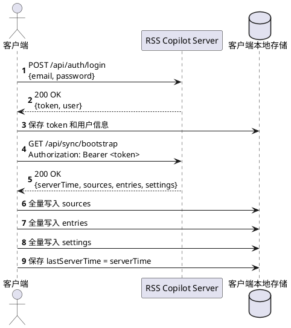
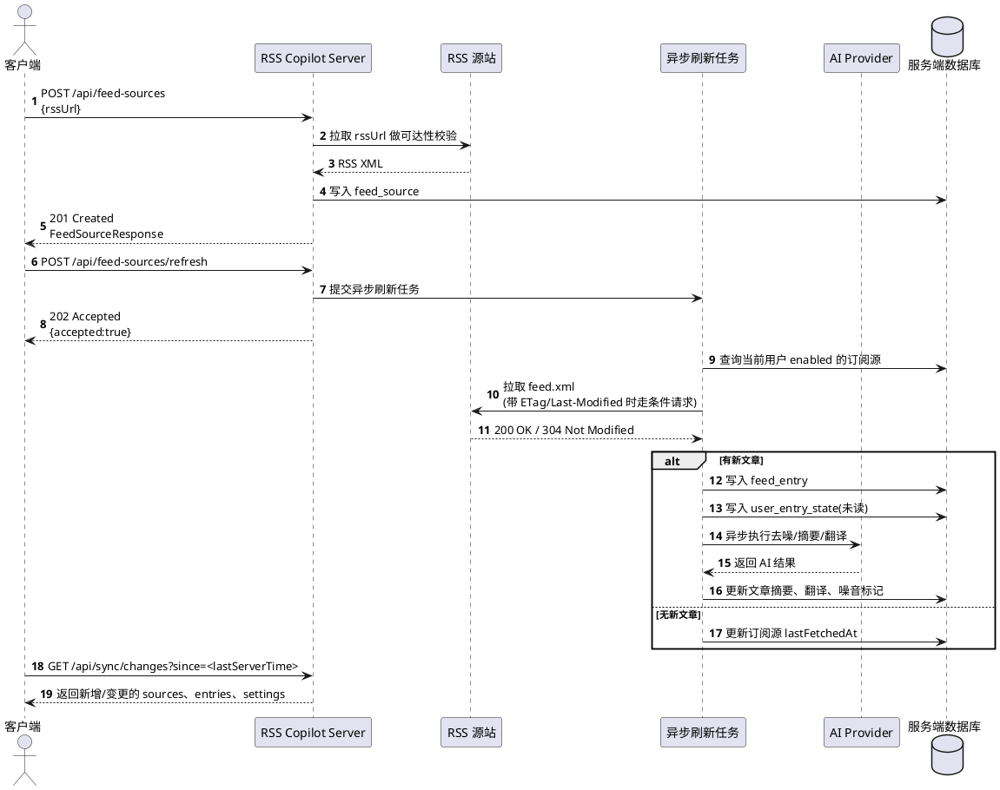
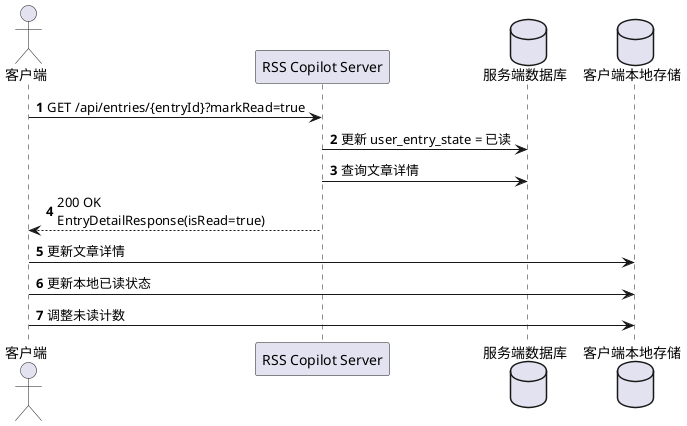
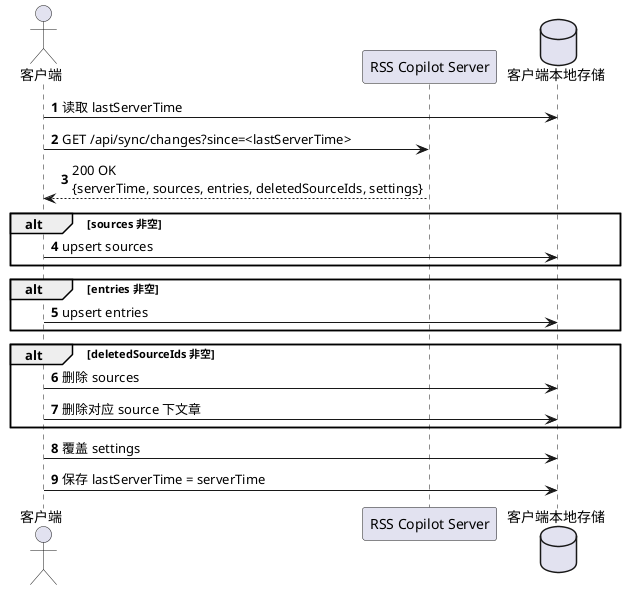
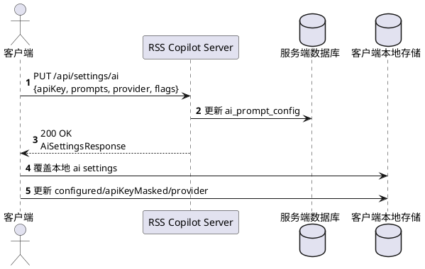

# RSS Copilot Server 接口文档

本文档面向客户端开发人员，描述当前服务端已经实现的接口、协议约定、请求头、请求参数、响应结构以及接入注意事项。客户端应以本文档和现有接口行为为准进行开发。

## 1. 服务概览

- 基础地址：`http://<host>:<port>`
- 默认端口：`8080`
- 接口前缀：`/api`
- 协议：`HTTP/1.1`
- 数据格式：`application/json`
- 字符编码：`UTF-8`

当前接口分为 5 组：

1. 认证：登录、获取当前用户、退出登录
2. 订阅源：订阅源增删改查、手动刷新、按订阅查看文章
3. 文章：Feed/Noise/All 列表、详情、已读状态管理
4. 设置：AI 配置、外观、语言、账号信息
5. 同步：全量快照、增量同步

## 2. 通用协议约定

### 2.1 请求头

除 `POST /api/auth/login` 外，所有 `/api/**` 接口都必须带 Bearer Token：

```http
Authorization: Bearer <token>
```

发送 JSON 请求体时请携带：

```http
Content-Type: application/json
Accept: application/json
```

### 2.2 认证方式

- 登录成功后，服务端返回 `token`
- 客户端自行持久化 `token`
- 之后所有受保护接口都通过 `Authorization: Bearer <token>` 调用
- 服务端为无状态 Bearer Session
- Session 默认有效期为 30 天
- 每次成功访问受保护接口，服务端都会刷新 Session 过期时间

### 2.3 时间格式

所有时间字段都使用 ISO 8601 UTC 字符串，例如：

```text
2026-04-08T10:00:00Z
```

同步接口中的 `since` 参数也必须传这个格式。

### 2.4 成功响应

- `200 OK`：普通查询/更新成功
- `201 Created`：创建成功
- `202 Accepted`：异步任务已接收
- `204 No Content`：成功但无响应体

### 2.5 失败响应

统一错误结构：

```json
{
  "code": "UNAUTHORIZED",
  "message": "invalid session",
  "timestamp": "2026-04-10T09:12:33.123Z"
}
```

常见错误码：

| HTTP 状态 | code | 说明 |
| --- | --- | --- |
| 400 | `BAD_REQUEST` | 参数错误、URL 非法、RSS 无法访问、请求体验证失败 |
| 401 | `UNAUTHORIZED` | 未登录、Token 缺失、Token 无效、Session 过期 |
| 404 | `NOT_FOUND` | 资源不存在 |
| 409 | `CONFLICT` | 资源冲突，例如重复添加同一个 RSS 源 |
| 500 | `INTERNAL_SERVER_ERROR` | 服务器内部异常 |

说明：

- 参数校验失败时，`message` 固定为 `request validation failed`
- 未预期异常会返回 `INTERNAL_SERVER_ERROR`

## 3. 数据结构

### 3.1 AuthUserResponse

```json
{
  "id": 1,
  "email": "demo@example.com",
  "displayName": "Demo User"
}
```

### 3.2 FeedSourceResponse

```json
{
  "id": 1,
  "name": "Sample Feed",
  "rssUrl": "https://example.com/feed.xml",
  "siteUrl": "https://example.com",
  "iconUrl": "https://example.com/favicon.ico",
  "enabled": true,
  "lastFetchedAt": "2026-04-08T11:00:00Z",
  "hasError": false,
  "unreadCount": 3
}
```

字段说明：

| 字段 | 类型 | 说明 |
| --- | --- | --- |
| `id` | number | 订阅源 ID |
| `name` | string | 订阅源名称 |
| `rssUrl` | string | RSS 地址 |
| `siteUrl` | string \| null | 站点地址 |
| `iconUrl` | string \| null | 图标地址 |
| `enabled` | boolean | 是否启用 |
| `lastFetchedAt` | string \| null | 最近一次刷新时间 |
| `hasError` | boolean | 最近一次刷新是否失败 |
| `unreadCount` | number | 当前订阅源下主 Feed 未读数，不包含噪音文章 |

### 3.3 EntryListItemResponse

```json
{
  "id": 101,
  "sourceId": 1,
  "sourceName": "Sample Feed",
  "title": "Long Analysis",
  "link": "https://example.com/articles/1",
  "publishedAt": "2026-04-08T10:00:00Z",
  "summary": "这是一篇关于技术趋势的长文摘要。",
  "isRead": false,
  "foreign": true,
  "coverImageUrl": "https://example.com/image.png"
}
```

字段说明：

| 字段 | 类型 | 说明 |
| --- | --- | --- |
| `id` | number | 文章 ID |
| `sourceId` | number | 所属订阅源 ID |
| `sourceName` | string | 所属订阅源名称 |
| `title` | string | 标题 |
| `link` | string | 原文链接 |
| `publishedAt` | string | 发布时间 |
| `summary` | string \| null | 优先返回 AI 摘要，否则回退 RSS 摘要 |
| `isRead` | boolean | 是否已读 |
| `foreign` | boolean | 是否被识别为外语内容 |
| `coverImageUrl` | string \| null | 封面图 |

### 3.4 EntryDetailResponse

```json
{
  "id": 101,
  "sourceId": 1,
  "sourceName": "Sample Feed",
  "title": "Long Analysis",
  "link": "https://example.com/articles/1",
  "publishedAt": "2026-04-08T10:00:00Z",
  "summary": "这是一篇关于技术趋势的长文摘要。",
  "isRead": false,
  "foreign": true,
  "contentHtml": "<article><p>...</p></article>",
  "filterReason": "有分析",
  "translationSegments": [
    {
      "source": "First paragraph.",
      "translation": "第一段。"
    }
  ]
}
```

字段说明：

| 字段 | 类型 | 说明 |
| --- | --- | --- |
| `contentHtml` | string \| null | 正文 HTML，可直接用于阅读页渲染 |
| `filterReason` | string \| null | AI 去噪原因 |
| `translationSegments` | array | 按段落拆分的翻译结果，可能为空数组 |

### 3.5 SettingsResponse

```json
{
  "ai": {
    "provider": "DEEPSEEK",
    "configured": true,
    "apiKeyMasked": "sk-***est",
    "filterPrompt": "保留高质量分析内容",
    "summaryPrompt": "用 80 字总结",
    "translationPrompt": "翻译成中文",
    "autoSummaryEnabled": true,
    "autoTranslationEnabled": false,
    "outputLanguage": "zh-CN"
  },
  "appearance": {
    "themeMode": "SYSTEM"
  },
  "feeds": {
    "defaultLanguage": "zh-CN",
    "refreshPolicyDescription": "固定每小时自动刷新一次"
  },
  "account": {
    "email": "demo@example.com",
    "displayName": "Demo User"
  }
}
```

### 3.6 SyncBootstrapResponse

```json
{
  "serverTime": "2026-04-10T09:20:00Z",
  "sources": [],
  "entries": [],
  "settings": {}
}
```

### 3.7 SyncChangesResponse

```json
{
  "serverTime": "2026-04-10T09:20:00Z",
  "sources": [],
  "entries": [],
  "deletedSourceIds": [],
  "settings": {}
}
```

## 4. 认证接口

### 4.1 登录

`POST /api/auth/login`

请求体：

```json
{
  "email": "demo@example.com",
  "password": "pass123456"
}
```

字段要求：

| 字段 | 必填 | 类型 | 说明 |
| --- | --- | --- | --- |
| `email` | 是 | string | 邮箱，服务端会转为小写处理 |
| `password` | 是 | string | 登录密码 |

成功响应 `200 OK`：

```json
{
  "token": "<bearer-token>",
  "user": {
    "id": 1,
    "email": "demo@example.com",
    "displayName": "Demo User"
  }
}
```

失败场景：

- `401 UNAUTHORIZED`：邮箱或密码错误
- `400 BAD_REQUEST`：邮箱格式非法或字段缺失

### 4.2 获取当前用户

`GET /api/auth/me`

请求头：

```http
Authorization: Bearer <token>
```

成功响应 `200 OK`：

```json
{
  "id": 1,
  "email": "demo@example.com",
  "displayName": "Demo User"
}
```

### 4.3 退出登录

`POST /api/auth/logout`

请求头：

```http
Authorization: Bearer <token>
```

成功响应：`204 No Content`

说明：

- 退出后当前 Token 立即失效
- 客户端应同时清理本地 Token

## 5. 订阅源接口

### 5.1 获取订阅源列表

`GET /api/feed-sources`

成功响应 `200 OK`：

```json
[
  {
    "id": 1,
    "name": "Sample Feed",
    "rssUrl": "https://example.com/feed.xml",
    "siteUrl": "https://example.com",
    "iconUrl": "https://example.com/favicon.ico",
    "enabled": true,
    "lastFetchedAt": "2026-04-08T11:00:00Z",
    "hasError": false,
    "unreadCount": 3
  }
]
```

### 5.2 新增订阅源

`POST /api/feed-sources`

请求体：

```json
{
  "rssUrl": "https://example.com/feed.xml"
}
```

字段要求：

| 字段 | 必填 | 类型 | 说明 |
| --- | --- | --- | --- |
| `rssUrl` | 是 | string | RSS 地址 |

成功响应 `201 Created`：

```json
{
  "id": 1,
  "name": "Sample Feed",
  "rssUrl": "https://example.com/feed.xml",
  "siteUrl": "https://example.com",
  "iconUrl": "https://example.com/favicon.ico",
  "enabled": true,
  "lastFetchedAt": null,
  "hasError": false,
  "unreadCount": 0
}
```

失败场景：

- `400 BAD_REQUEST`：URL 非法，或 RSS 地址不可达/不可解析
- `409 CONFLICT`：当前用户已存在相同 `rssUrl` 的订阅源

说明：

- 创建时只会校验 RSS 可访问并初始化订阅源信息
- 创建完成后不会立即拉取文章
- 客户端如果希望立刻看到文章，应继续调用 `POST /api/feed-sources/refresh`

### 5.3 更新订阅源

`PUT /api/feed-sources/{sourceId}`

路径参数：

| 参数 | 类型 | 说明 |
| --- | --- | --- |
| `sourceId` | number | 订阅源 ID |

请求体：

```json
{
  "name": "Sample Feed",
  "rssUrl": "https://example.com/feed.xml",
  "iconUrl": "https://example.com/favicon.ico",
  "enabled": true
}
```

字段要求：

| 字段 | 必填 | 类型 | 说明 |
| --- | --- | --- | --- |
| `name` | 是 | string | 订阅源展示名 |
| `rssUrl` | 是 | string | RSS 地址 |
| `iconUrl` | 否 | string \| null | 图标地址 |
| `enabled` | 是 | boolean | 是否启用自动刷新 |

成功响应 `200 OK`：返回更新后的 `FeedSourceResponse`

失败场景：

- `404 NOT_FOUND`：订阅源不存在
- `400 BAD_REQUEST`：`rssUrl` 非法

说明：

- 更新接口不会主动刷新 RSS 内容
- 修改 `rssUrl` 后，客户端应主动调用刷新接口，以便拉取新源内容并更新 `siteUrl`/`iconUrl` 等元数据

### 5.4 删除订阅源

`DELETE /api/feed-sources/{sourceId}`

成功响应：`204 No Content`

失败场景：

- `404 NOT_FOUND`：订阅源不存在

说明：

- 删除订阅源后，服务端会记录 tombstone
- 同步接口会通过 `deletedSourceIds` 返回删除的订阅源 ID
- 客户端删除订阅源时，也应同步删除本地该订阅源下的文章

### 5.5 手动刷新全部订阅源

`POST /api/feed-sources/refresh`

成功响应 `202 Accepted`：

```json
{
  "accepted": true
}
```

说明：

- 这是异步接口
- 只负责触发任务，不保证请求返回时刷新已完成
- 客户端应通过以下方式拿到最新数据：
  - 轮询 `GET /api/entries`
  - 或调用同步接口 `GET /api/sync/changes`

### 5.6 查看某个订阅源下的文章

`GET /api/feed-sources/{sourceId}/entries`

成功响应 `200 OK`：

```json
{
  "items": [
    {
      "id": 101,
      "sourceId": 1,
      "sourceName": "Sample Feed",
      "title": "Long Analysis",
      "link": "https://example.com/articles/1",
      "publishedAt": "2026-04-08T10:00:00Z",
      "summary": "这是一篇关于技术趋势的长文摘要。",
      "isRead": false,
      "foreign": true,
      "coverImageUrl": "https://example.com/image.png"
    }
  ]
}
```

说明：

- 该接口固定返回当前订阅源下的全部文章
- 同时包含主 Feed 和 Noise 文章
- 不支持额外查询参数

## 6. 文章接口

### 6.1 文章列表

`GET /api/entries`

查询参数：

| 参数 | 必填 | 类型 | 默认值 | 说明 |
| --- | --- | --- | --- | --- |
| `view` | 否 | string | `feed` | 视图类型：`feed`、`noise`、`all` |
| `unreadOnly` | 否 | boolean | `false` | 是否只看未读 |

成功响应 `200 OK`：

```json
{
  "items": [
    {
      "id": 101,
      "sourceId": 1,
      "sourceName": "Sample Feed",
      "title": "Long Analysis",
      "link": "https://example.com/articles/1",
      "publishedAt": "2026-04-08T10:00:00Z",
      "summary": "这是一篇关于技术趋势的长文摘要。",
      "isRead": false,
      "foreign": true,
      "coverImageUrl": "https://example.com/image.png"
    }
  ]
}
```

规则说明：

- `view=feed`：仅返回非噪音文章
- `view=noise`：仅返回噪音文章
- `view=all`：返回全部文章
- 非法 `view` 会被服务端自动当作 `feed`
- 当前实现单次最多返回 100 条，按 `publishedAt DESC, id DESC` 排序

### 6.2 获取文章详情

`GET /api/entries/{entryId}`

路径参数：

| 参数 | 类型 | 说明 |
| --- | --- | --- |
| `entryId` | number | 文章 ID |

查询参数：

| 参数 | 必填 | 类型 | 默认值 | 说明 |
| --- | --- | --- | --- | --- |
| `markRead` | 否 | boolean | `false` | 是否在读取详情时顺便标记为已读 |

成功响应 `200 OK`：返回 `EntryDetailResponse`

失败场景：

- `404 NOT_FOUND`：文章不存在

说明：

- 阅读页推荐使用这个接口
- 如果客户端希望进入详情页即标记已读，可传 `markRead=true`

### 6.3 标记单篇已读

`POST /api/entries/{entryId}/read`

成功响应：`204 No Content`

### 6.4 标记单篇未读

`POST /api/entries/{entryId}/unread`

成功响应：`204 No Content`

### 6.5 批量标记已读

`POST /api/entries/read-all`

查询参数：

| 参数 | 必填 | 类型 | 默认值 | 说明 |
| --- | --- | --- | --- | --- |
| `view` | 否 | string | `feed` | 批量标记范围：`feed`、`noise`、`all` |

成功响应 `200 OK`：

```json
{
  "updatedCount": 12
}
```

说明：

- `view=feed`：批量已读主 Feed
- `view=noise`：批量已读噪音箱
- `view=all`：批量已读全部文章
- 非法 `view` 会被当作 `feed`

## 7. 设置接口

### 7.1 获取设置

`GET /api/settings`

成功响应 `200 OK`：返回 `SettingsResponse`

说明：

- 该接口返回 AI、外观、Feed、账号四个分组
- `apiKeyMasked` 仅返回脱敏值，不会返回真实密钥

### 7.2 更新 AI 设置

`PUT /api/settings/ai`

请求体：

```json
{
  "apiKey": "sk-demo-test",
  "filterPrompt": "保留高质量分析内容",
  "summaryPrompt": "用 80 字总结",
  "translationPrompt": "翻译成中文",
  "autoSummaryEnabled": true,
  "autoTranslationEnabled": false,
  "outputLanguage": "zh-CN",
  "provider": "DEEPSEEK"
}
```

字段要求：

| 字段 | 必填 | 类型 | 说明 |
| --- | --- | --- | --- |
| `apiKey` | 否 | string \| null | API Key，传空字符串或 `null` 表示清空 |
| `filterPrompt` | 是 | string | 去噪 Prompt |
| `summaryPrompt` | 是 | string | 摘要 Prompt |
| `translationPrompt` | 是 | string | 翻译 Prompt |
| `autoSummaryEnabled` | 是 | boolean | 是否自动生成摘要 |
| `autoTranslationEnabled` | 是 | boolean | 是否自动生成翻译 |
| `outputLanguage` | 是 | string | 输出语言，例如 `zh-CN` |
| `provider` | 是 | string | AI 提供方，当前默认值为 `DEEPSEEK` |

成功响应 `200 OK`：

```json
{
  "provider": "DEEPSEEK",
  "configured": true,
  "apiKeyMasked": "sk-***est",
  "filterPrompt": "保留高质量分析内容",
  "summaryPrompt": "用 80 字总结",
  "translationPrompt": "翻译成中文",
  "autoSummaryEnabled": true,
  "autoTranslationEnabled": false,
  "outputLanguage": "zh-CN"
}
```

说明：

- 服务端会把 `provider` 统一转为大写存储
- `configured=true` 表示当前用户已配置有效的 `apiKey`

## 8. 同步接口

同步接口用于客户端首屏初始化和多端轮询同步。

### 8.1 全量快照

`GET /api/sync/bootstrap`

成功响应 `200 OK`：

```json
{
  "serverTime": "2026-04-10T09:20:00Z",
  "sources": [
    {
      "id": 1,
      "name": "Sample Feed",
      "rssUrl": "https://example.com/feed.xml",
      "siteUrl": "https://example.com",
      "iconUrl": "https://example.com/favicon.ico",
      "enabled": true,
      "lastFetchedAt": "2026-04-08T11:00:00Z",
      "hasError": false,
      "unreadCount": 1
    }
  ],
  "entries": [
    {
      "id": 101,
      "sourceId": 1,
      "sourceName": "Sample Feed",
      "title": "Long Analysis",
      "link": "https://example.com/articles/1",
      "publishedAt": "2026-04-08T10:00:00Z",
      "summary": "这是一篇关于技术趋势的长文摘要。",
      "isRead": false,
      "foreign": true,
      "contentHtml": "<article><p>...</p></article>",
      "filterReason": "有分析",
      "translationSegments": []
    }
  ],
  "settings": {
    "ai": {
      "provider": "DEEPSEEK"
    }
  }
}
```

说明：

- 返回当前用户的完整状态快照
- 适合客户端首次启动、重新登录后的全量初始化
- `entries` 返回的是详情结构，不是列表结构

### 8.2 增量同步

`GET /api/sync/changes`

查询参数：

| 参数 | 必填 | 类型 | 说明 |
| --- | --- | --- | --- |
| `since` | 是 | string | ISO 8601 UTC 时间，例如 `2026-04-08T00:00:00Z` |

成功响应 `200 OK`：

```json
{
  "serverTime": "2026-04-10T09:25:00Z",
  "sources": [],
  "entries": [],
  "deletedSourceIds": [3],
  "settings": {
    "ai": {
      "provider": "DEEPSEEK"
    }
  }
}
```

字段说明：

| 字段 | 类型 | 说明 |
| --- | --- | --- |
| `serverTime` | string | 本次同步的服务端时间戳，建议客户端保存，供下次 `since` 使用 |
| `sources` | array | `since` 之后有变更的订阅源 |
| `entries` | array | `since` 之后有变更的文章详情 |
| `deletedSourceIds` | array<number> | `since` 之后删除的订阅源 ID |
| `settings` | object | 当前最新设置，服务端每次都会返回完整设置 |

客户端建议同步策略：

1. 首次登录后先调用 `/api/sync/bootstrap`
2. 将返回的 `serverTime` 记为本地同步游标
3. 后续周期性调用 `/api/sync/changes?since=<lastServerTime>`
4. 用本次返回的 `serverTime` 覆盖本地游标
5. 对 `deletedSourceIds` 做删除，同时清理本地对应订阅源及其文章

## 9. 推荐客户端接入流程

### 9.1 登录后初始化

1. 调用 `POST /api/auth/login`
2. 保存 `token`
3. 调用 `GET /api/sync/bootstrap`
4. 本地落库 `sources`、`entries`、`settings`
5. 保存 `serverTime`

### 9.2 新增订阅源

1. 调用 `POST /api/feed-sources`
2. 调用 `POST /api/feed-sources/refresh`
3. 轮询 `GET /api/sync/changes` 或 `GET /api/entries`
4. 拿到文章后刷新列表页

### 9.3 阅读文章

两种方式都可用：

1. 列表点击后调用 `GET /api/entries/{entryId}?markRead=true`
2. 先调用 `GET /api/entries/{entryId}`，再单独调用 `POST /api/entries/{entryId}/read`

### 9.4 定时同步

建议客户端每隔一段时间调用：

```text
GET /api/sync/changes?since=<lastServerTime>
```

推荐场景：

- App 回到前台
- 首页定时轮询
- 手动下拉刷新完成后补一次增量同步

## 10. 核心时序图（PlantUML）

以下时序图用于描述客户端最核心的调用链路，便于客户端开发人员按顺序接入。

### 10.1 登录并初始化全量数据



### 10.2 新增订阅源并触发刷新



### 10.3 进入文章详情并标记已读



如果客户端不希望“打开详情即已读”，则改为：

1. `GET /api/entries/{entryId}`
2. 用户确认已读后，再调用 `POST /api/entries/{entryId}/read`

### 10.4 增量同步轮询



### 10.5 更新 AI 设置



## 11. 当前实现注意事项

以下内容是按当前后端实现整理出的客户端注意事项，客户端需要按现状适配：

### 11.1 列表暂不支持分页

- `GET /api/entries` 当前单次最多返回 100 条
- `GET /api/feed-sources/{sourceId}/entries` 也走同一套列表限制
- 客户端应先按当前无分页能力实现

### 11.2 刷新接口是异步的

- `POST /api/feed-sources/refresh` 返回 `202` 仅表示任务已提交
- 不能以该请求结束作为“文章已刷新完成”的判断条件

### 11.3 同步删除只返回订阅源删除

- `deletedSourceIds` 只覆盖订阅源
- 订阅源删除后，客户端应自行删除该源下所有文章

### 11.4 增量同步更适合内容变化同步

当前增量文章同步是基于文章自身的 `updated_at` 字段返回的，适用于以下场景：

- 新文章入库
- AI 去噪结果更新
- AI 摘要更新
- AI 翻译更新

客户端在设计本地同步时，建议把“阅读状态变更”和“内容变更”分开考虑，不要假设所有阅读状态变化都一定会通过 `entries` 的增量返回体现。

### 11.5 AI 结果是渐进可用的

- 文章先入库，后异步执行去噪、摘要、翻译
- 某篇文章刚抓取时，`summary` 可能还是 RSS 摘要
- `translationSegments` 可能暂时为空数组
- 客户端应允许内容逐步变完整
